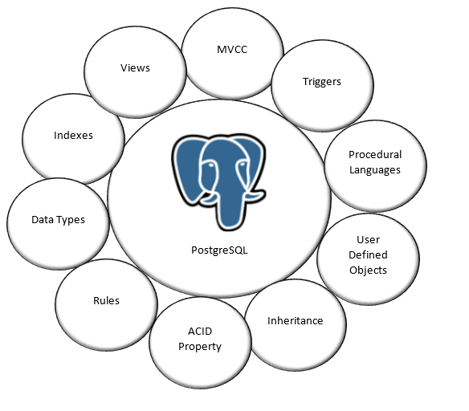

## What is PostgreSql
- Open source `object`-relational database.
- C base.

## Why use PostgreSql
- Free.
- ACID-compliant (160 / 179)
- Fault-tolerant environments
- PostGIS geospatial database extender (add-ons)
- Define your own data types, custom function
- Up to date with market trends.

## Where to use PostgreSql
- Local machine.
- Cloud machine (Ec2,..)
- Docker.

## When to use PostgreSql
- Data warehousing, data analysis
- Complex queries
- Read/write speed are critical.
- Concurrency.

## Major features:
1. Data type:
	- Primitives (integer, numeric, string, boolean, etc)
	- Structured (date/time, timestamp, interval, array, range, uuid, enum, etc)
	- Documents (JSON, XML, Hstore, etc)
	- Geometry (point, line, circle, polygon, etc)
	- Customized Types.
2. Data integrity:
	- UNIQUE, NOT NULL, Primary Keys, Foreign Keys and Exclusions
	- Explicit Locking (full ACID supported) ([Nice Doc](https://www.studytonight.com/plsql/locks-in-plsql))
	- Advisory Locks - application level lock ([Nice Doc](http://shiroyasha.io/advisory-locks-and-how-to-use-them.html))
3. Concurrency and performance:
	- Multiples index technique (B-tree, Multicolumn, Expressions, Partial, GiST, SPGist, KNN Gist, GIN, BRIN, Bloom filters)
	- Query planner or EXPLAIN (optimizer) 
	- index-only scans (fetch data from index only, not from HEAP(table)) and multi-column statistics
	- Transactions, Nested Transactions (via save points - easy to rollback inside a transaction)
	- Multi-Version concurrency Control (MVCC) ([Nice Doc](https://jb-blog.readthedocs.io/en/latest/posts/0028-mvcc-in-postgresql.html))
	- Parallelization of read queries and Declarative Table partitioning
4. Readability, disaster recovery
	- Write-ahead logging (WAL)
	- Master/Slave Native Replication
	- Asynchronous, Synchronous, Logical (providing Publicator / Subscription resources)
	- Point-in-time recovery (PITR) or use active standbys
	- Distribute data between storages using Tablespaces.
5. Security:
	- Ssl-encryption native support between client and database.
	- Robust access-control system, in table, objects, columns and row-level
6. Internationalization, Text search:
	- Support international character sets.
	- Native full-text search
7. Not relational data(Json, Hstore):
	- Can be treated as no-sql
	- Use documents as native data
	- Can be index
8. GIS (Geographic information system):
	- Add-on that store geographic objects

    

Prefer: [Medium Post](https://medium.com/we-build-state-of-the-art-software-creating/why-should-i-use-postgresql-as-database-in-my-startup-company-96de2fd375a9)